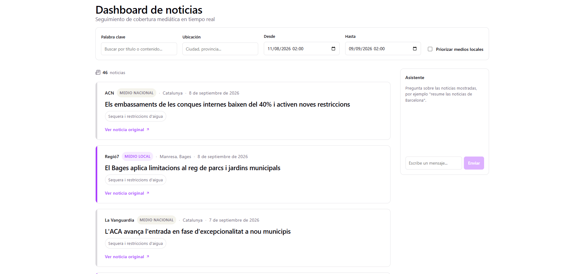

# Fact-Help — Asistente Periodístico RAG

Proyecto desarrollado en equipo durante el hackathon **BCN Media Party** (un día). Dashboard de seguimiento de cobertura mediática con un asistente conversacional que responde preguntas ancladas exclusivamente en las noticias mostradas, citando siempre su medio de origen.



## Qué resuelve

Buscar cobertura mediática sobre un tema o zona concreta y poder preguntarle directamente al conjunto de noticias ("resume las noticias de Barcelona") sin que el asistente invente información que no esté en las fuentes recuperadas.

## Cómo funciona

1. El usuario filtra noticias por palabra clave, ubicación y rango de fechas.
2. Al hacer una pregunta al asistente, el backend genera el embedding de la pregunta y de cada noticia del corpus (Cloudflare Workers AI) y calcula similitud coseno para recuperar las 6 noticias más relevantes (umbral 0.3).
3. Esas noticias se pasan como contexto a un LLM (`@cf/meta/llama-3.3-70b-instruct-fp8-fast`, vía AI Gateway), con instrucción explícita de responder solo con lo que aparece en el contexto y citar los medios.

## Stack

| | |
|---|---|
| Backend | TypeScript, Cloudflare Workers, Cloudflare Workers AI (embeddings + LLM) |
| Frontend | Vue 3, Vite, servido como static assets desde el mismo Worker |
| Infraestructura | Wrangler, pnpm workspaces |
| CI | GitHub Actions (lint + build) |

## Equipo

Construido en equipo por [Ruth López Pellicer](https://github.com/Ruthlessallen) y [Noel De Martin](https://github.com/NoelDeMartin) durante el hackathon BCN Media Party.

## Estado y siguientes pasos

- [x] Pipeline RAG completo funcionando (embeddings + recuperación + generación)
- [x] Frontend Vue 3 integrado como static assets en el Worker
- [x] CI configurado (lint + build)
- [ ] **Despliegue público en Cloudflare Workers** — próximo paso, el proyecto funciona en local (`wrangler dev`) pero aún no tiene URL pública

## Desarrollo local

```bash
pnpm install
pnpm run dev   # wrangler dev
```
